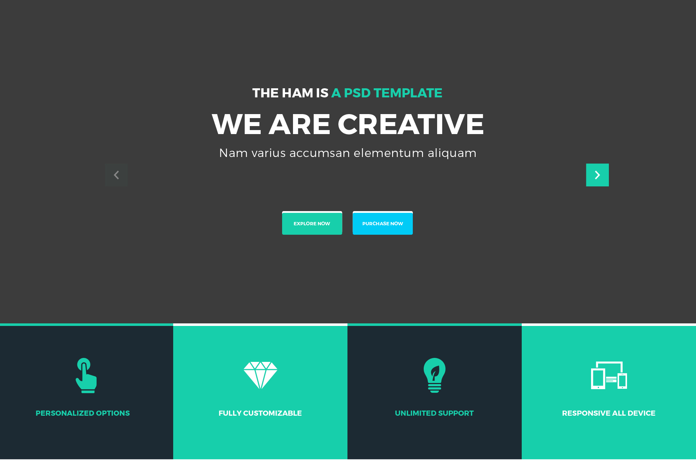
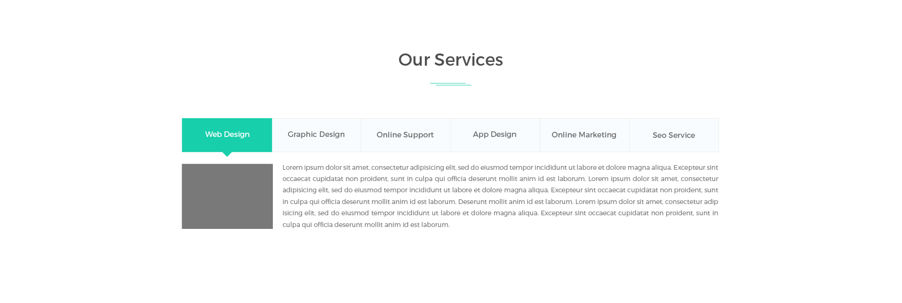
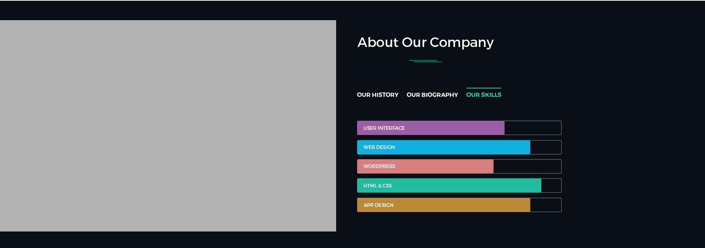
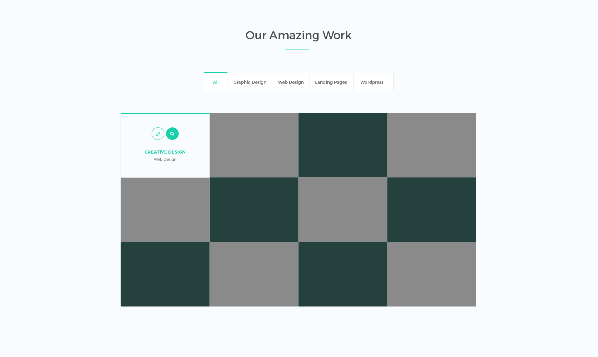
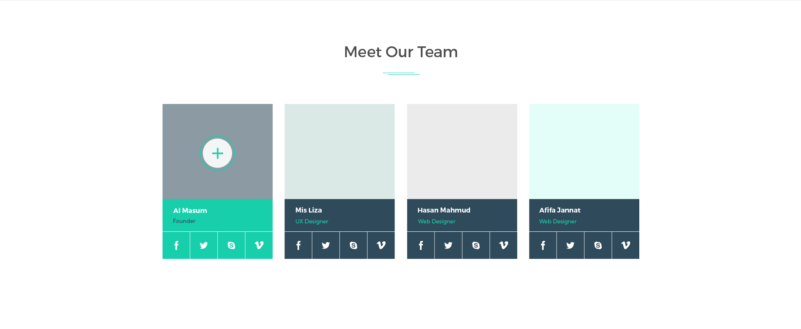
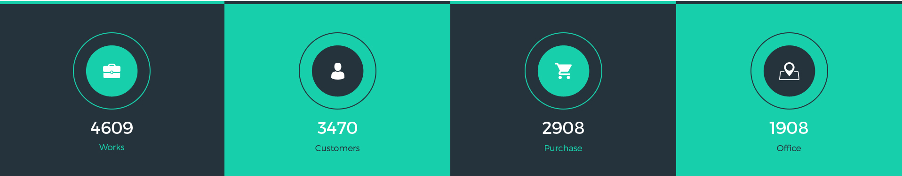
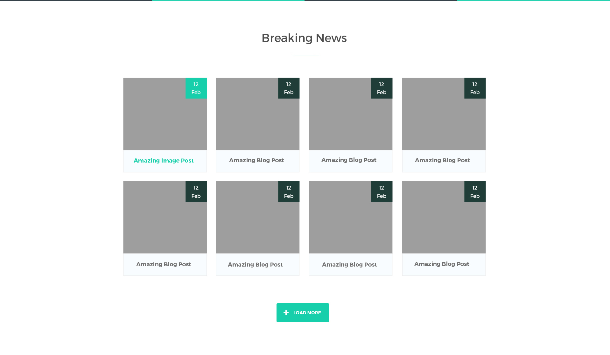
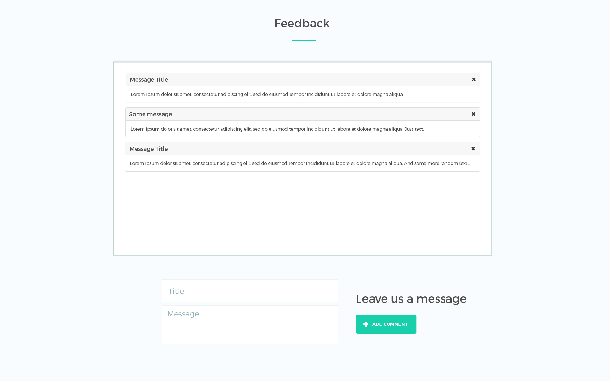

## Задача 
* Создание сайта-портфолио по предоставленному psd макету. 

## Общие требования к сайту 
* Корректное отображение сайта на следующих разрешениях экрана: 320px, 687px, 992px, 1200 px 
* Поддержка браузеров: последние версии Chrome, Firefox, Safarі, Opera, MS Edge. 
* Для реализации функционала сайта используйте ReactJS. 

## Структура сайта: 

### Header 
  

* Меню дожно быть зафиксировано в верхней части экрана, чтобы пользователь мог им всегда воспользоватся. 
* При нажатии на каждый элемент меню страница плавно прокручивается до соответствующего блока на странице. 

 

* Создайте три слайда с произвольным изображением и текстом.
* Смена слайдов должна присходить с интервалом в 3с. 
* По нажатию стелок навигации, автоматическая смена слайдов должна приостанавливатся, 
  пока пользователь листает слайды вручную. Если в течении 5с пользователь не нажимал на элементы навигации, 
  должна возобновиться автоматическая смена слайдов. 

* При нажатии на кнопку Explore Now страница плавно прокручивается до блока портфолио. 
* При нажатии на кнопку Purchase Now страница плавно прокручивается до блока контактов. 

* Для реализации плавной прокрутки страницы разрешается использовать сторонние ресурсы(например, https://github.com/fisshy/react-scroll). 

### Блок Our Services 
  

* При клике по каждой из иконок сервисов открывается вкладка с изображением(используйте произвольные изображения) и текстом описания сервиса. 
* Используйте маршрутизацию для реализации переключения вкладок. 

### Блок About Our Company 
  

* Блок с описанием компании. 
* По умолчанию открыта вкладка Our Skills. 

* Когда блок только появился в области видимости страницы, в течении 3 секунд ширина блоков диаграммы изменяется от 0 до значений, указанных в макете. 
* Для создания анимации используйте аддон ReactCSSTransitionGroup. Установка аддона:  
 
```
npm install react-addons-css-transition-group
``` 
* При переключении вкладок отображается соответствующая информация(см. макет). 

### Блок портфолио  
 
 
* Добавьте произвольные изображения в портфолио. 
* Реализуйте фильтрацию изображений по категориям. 
* При наведении курсора мыши на изображение над ним появляется полупрозрачный слой с информацией о том к какой категории относится данное изображение. 

### Блок Our Team 
  

* Добавьте произвольное фото для членов команды. 
* При наведении мыши на иконки ссылок социальных сетей они меняют цвет. 

### Блок со статистикой достижений 
  

* Когда блок только появился в видимой области страницы, течении 3 секунд происходит отсчет от 0 до значений, указанных в макете.

### Блок News 
  

* Добавьте произвольные изображения в превью новостей.
* Загрузите описание новостей из JSON-файла(файл data.json в папке project). 
* Изначально после загрузки страницы отображается 8 новостей. 

* При нажатии на изображение выполняется переход по пути '/id', где id - id новости. На открывшейся странице отображается дата и текст новости. 
* Маршрутизацию нужно реализовать без перезагрузки страницы.  

* При нажатии на кнопку load more на странице должны отображаются следующие 8 новостей из файла data.json. 

### Блок Feedback 
 

* Форма с полями Title и Message. Поля обязательны для заполнения. 
* При нажатии на кнопку Add Comment в окно сообщений добавляется панель сообщения, содержащая заголовок и текст сообщения(данные из формы). 
* Данные сообщений сохраняются в массив messages (каждый элемент массива - объект со свойствами id, title, text). 
* При нажатии на икноку удаления в верхнем правом углу панели сообщения, оно удаляется (не только со страницы, но также из массива messages). 

* Сохраните данные массива messages в cookies и используйте их для отображения прошлых сообщений при перезагрузке страницы. 

* Для решения задачи используйте Webpack и синтаксис ES6.  

### Блок контактов 
  

* Добавьте в блок карту с координатами компании(используйте сервис Google maps). 

* Форма с полями Name, Email, Message. Валидация формы происходит при нажатии на клавиши. При вводе пользователем некорректных данных в поле ввода под этим полем сразу отображается сообщение об ошибке. Сообщение об ошибке сразу же скрывается, если пользователь ввел корректные данные. 
* В поле Name допускаются только буквы английского алфавита.
* В поле Email допускаются толко буквы английского алфавита, цифры, знак подчеркивание и симвом @. 
* В поле Message допускаются любые символы. Минимальная длина сообщения - 20 символов. 

### Footer 
  

* Копирайт и кнопка вверх. 
* При нажатии на кнопку страница плавно прокручивается в начало. 
